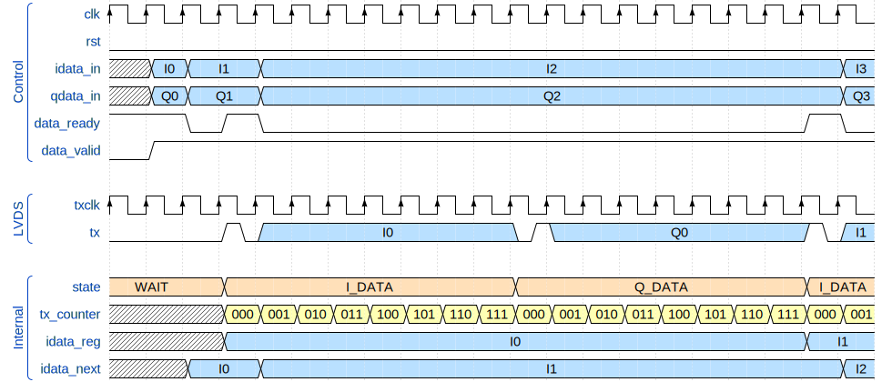
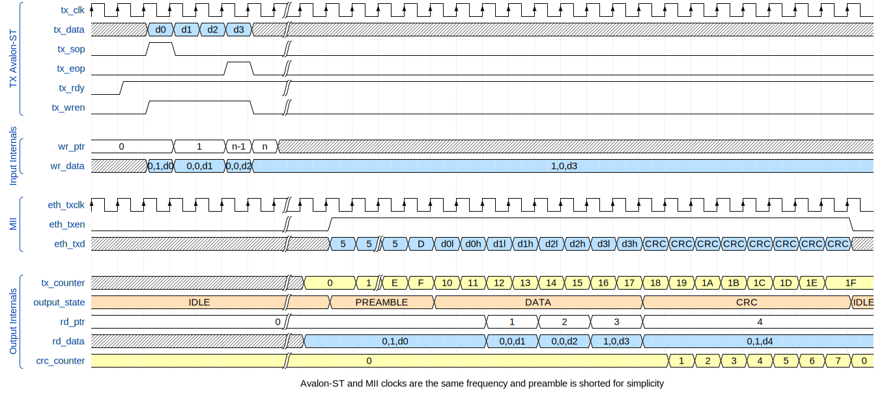

# FPGA SDR Code

Individual modules have more detailed readme files, but in summary, this project allows a AT86RF215 transceiver to be controlled over Ethernet and send/receive IQ data from GNU Radio.

## Status

| Module            | Status        | Testbench     | Test Results  |
| ----------------- | ------------- | ------------- | ------------- |
| Serializer        | In progress   | In progress   | N/A           |
| Deserializer      | In progress   | In progress   | N/A           |
| Packetizer        | Functional    | Functional    | Passing       |
| Depacketizer      | Not started   | Not started   | N/A           |
| SimpleMac         | Functional    | Functional    | Passing       |
| DataController    | In progress   | In progress   | N/A           |

## Modules

### Serializer

Sends data over LVDS using word structure defined in AT86RF215 datasheet page 24. Data input is captured when both data_valid and data_ready are asserted.

DDR functionality relies on generated Intel IP, so a non-synthesizable equivalent is used for simulation. It might actually be synthesizable in this specific case, but using the generated IP will almost definitely work better.

TODO: Verify reset behavior.

#### Ports

| Name | Direction | Description |
| --- | --- | --- |
| clk | input | 64 MHz clock input |
| rst | input | Synchronous reset, active high |
| idata_in | input | 14 bit I data |
| qdata_in | input | 14 bit Q data |
| data_valid | input | Data valid |
| data_ready | output | Data ready |
| txclk | output | LVDS clock |
| tx | output | LVDS data |

#### States

* STATE_INIT - only active after reset, initializes values to default
* STATE_WAIT - wait period at transmission start
* STATE_I_DATA - I data
* STATE_Q_DATA - Q data

#### Timing Diagram

### Deserializer

Receives data over LVDS using word structure defined in AT86RF215 datasheet page 24. Contains a 256 word deep FIFO to cross from LVDS clock domain into FPGA clock domain.

DDR functionality relies on generated Intel IP, so a non-synthesizable equivalent is used for simulation.

### Packetizer

Constructs packets using data received from Deserializer to send over Ethernet. Send a UDP packet containing a 64 bit packet ID and 366 samples of IQ data. Each I and Q component is 13 bits, but is sent as a 16 bit value to align the words with bytes. Fitting 13/26 bit samples in without worrying about byte boundaries would allow ~450 samples to fit in a packet, but would no longer be compatible with GNU Radio. Truncating samples to 8/16 bits would allow 732 samples/packet, but obviously lead to degraded performance. 2 transceivers at full sample rate and bit depth will require ~270 Mbps, so full performance is not currently possible with the 10/100 Ethernet PHY on the DECA. A single transceiver with truncated samples requires ~68 Mbps, which is feasible on the DECA.

TODO:
* Implement UDP and IP checksums
* Properly handle backpressure on TX bus (hopefully won't be an issue because LVDS input is the slowest link in the chain)

Misc notes
* 

### Depacketizer

### SimpleMac

Sends and receives packets over ethernet with Avalon-ST bus. Currently, only TX is implemented. Stores data in a 4096 word deep FIFO, enough to store 2 packets. The MAC transmits the data packets received over the Avalon-ST bus, with the ethernet preamble added to the beginning and the FCS added to the end. The testbench transmits random data over the Avalon-ST bus and checks to see if the same data is sent over the MII interface. It also verifies the FCS that is inserted at the end of the packet.

When preamble is detected on eth_rxd, STATE_DATA is entered. Data is written first to a 4 byte buffer, one nibble at a time. Every cycle, the contents are shifted down 4 bits and the newest nibble is written to the top. On every cycle, the bottom 4 bits are sent to the CRC module and on alternating cycles, the bottom byte are written to the FIFO. When eth_rxdv is deasserted, STATE_CRC is entered, the 4 byte buffer now contains the FCS of the packet. It's compared to the result from the CRC32 module, and if they're the same, the final byte of the packet is written with tlast asserted. Then, the FIFO write signals are set to default, rx_packets_ready is incremented and STATE_IDLE is entered. If the FCS does not match, the only difference is rx_packets_ready is not incremented and rx_wr_ptr is reset to the start of the current packet.

FIFO memory format (10 bits wide): {tuser, tlast, tdata[7:0]}

TODO:
* RX and TX error handling

Edge Cases

| Case | Status | Notes |
| --- | --- | --- |
| TX Overflow | Done | Back pressure on AXIS bus prevents overflow |
| TX Underflow | Done | Transmission does not start until entire packet is in FIFO |
| TX Error | Done | Error is signaled with `tuser` signal and FIFO write pointer is reset to start of packet |
| RX Overflow | Done | `tuser` and `tlast` signals are asserted and rest of packet is dropped |
| RX Underflow | Done | `tvalid` is not asserted unless data is in FIFO |
| RX Error | Done | Can be safely ignored, error will cause CRC to be invalid anyway |

#### Ports

| Name | Direction | Description |
| --- | --- | --- |
| rst | input | Synchronous reset to tx_clk, active high |
| eth_txclk | input | MII TX Clock (25 MHz) |
| eth_txen | output | MII TX Enable |
| eth_txd | output | MII TX Data (4 bits) |
| eth_rxclk | input | MII RX Clock |
| eth_rxdv | input | MII RX Data Valid |
| eth_rxer | input | MII RX Error |
| eth_rxd | input | MII RX Data (4 bits) |
| eth_col | input | MII Collision Detect |
| eth_crs | input | MII Carrier Sense |
| eth_pcf | output | MII PHY Control Frame Enable |
| eth_rstn | output | MII Reset, active low |
| tx_clk | input | Avalon-ST TX Clock |
| tx_data | input | Avalon-ST TX Data |
| tx_sop | input | Avalon-ST TX Start of Packet |
| tx_eop | input | Avalon-ST TX End of Packet |
| tx_err | input | Avalon-ST TX Error |
| tx_rdy | output | Avalon-ST TX Data Ready |
| tx_wren | input | Avalon-ST TX Write Enable |
| tx_a_full | output | Avalon-ST TX Almost Full |
| tx_a_empty | output | Avalon-ST TX Almost Empty |

#### Timing Diagram

#### CRC32

This module compute the CRC to be inserted at the end of the ethernet frame. The module is based on a parametrizable module from [Alex Forencich](https://github.com/alexforencich/verilog-ethernet). A simple testbench generates some random data and compares the resulting CRC to one generated with a known good library.

### DataController
